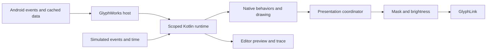

# GlyphWorks Pipeline Builder implementation plan

Status: implemented and locally verified. See [validation results](pipeline-validation.md)
for delivered artifacts, build/test evidence and the seven unchanged baseline
carousel-test failures.

Baseline: repository commit `e0fb789`, app version 3.4.4, inspected on 2026-10-06.
No release version is assigned by this plan.

Build one programmable execution system for Ambient, new user toys, copies of
built-in toys, automatic triggers, and an advanced replacement for Glyph navigation.
Use a native Compose block editor and a reusable Kotlin execution library, with an
Android AAR adapter. Keep the existing drawing code and Android integration where
they provide proven behavior, but give every running component explicit ownership
of its tasks, state, subscriptions, and display output.

## Confirmed product decisions

- Native behavior blocks are allowed. Users must also be able to construct their
  own behavior and replace artwork or animations inside native toys. Dino's jump
  animation is a required example.
- Built-in definitions are immutable. Users customize copies; upgrades do not
  overwrite those copies.
- Advanced mode owns Glyph activation, key handling, and its own on-Glyph menu.
  Pocket protection added by GlyphWorks is configurable in this mode. Android and
  Nothing OS restrictions remain outside the program's control.
- Advanced mode can only be enabled from App settings. While enabled, the Toys
  selector is unavailable; the controller project is the sole navigation authority.
- Ambient's old background selectors are replaced by a link in its settings popup
  to the full-screen Pipeline Builder, plus settings dedicated to its pipeline.
- The builder occupies its own activity with a freely pannable, zoomable canvas.
  Include an in-depth interactive tutorial using the production editor, covering
  Ambient, new toys, and custom controls and menus in advanced mode.
  Its interaction, appearance, and navigation must match the Custom Design Editor
  tutorial exactly, including demonstrated rather than user-gated editing steps.
- Sharing is included in the first complete delivery. Use documented, versioned
  JSON, related to the existing `glyph.design` format, with designs and reusable
  routines included in the exported file.
- Reuse the existing Android toy/service lifecycle and sensor access. Do not add
  a foreground service or an ongoing notification as part of this plan.
- Implementation and acceptance use local JVM, Robolectric, build, and render
  workflows. No phone, emulator, or implementation-time user intervention is a
  prerequisite. Final UI PNGs are required.
- Do not commit or publish. App version strings continue to come from generated
  build properties. Privacy-policy changes must be limited to actual changes in
  disclosed behavior.

Here, “whole app lifecycle” means the Glyph runtime: starting and stopping output,
choosing displays, interactions, menus, timers, and reactions. Android permission
grants, accessibility-service enablement, OS service binding, app updates, accounts,
and the app's recovery/settings UI stay with the host application. The previously
researched AI-activity detector is not an existing event source and is not silently
included. The event API will permit adding it later.

“Sound” initially means device playback activity and the existing output spectrum,
not recording environmental sound or speech.

## Findings from the current code

| Area | Existing behavior | Required change |
| --- | --- | --- |
| `Core.kt`, `SessionArbiter.kt`, `GlyphLink.kt` | One process object graph, TOY/DIRECT/PREVIEW ownership, SDK calls on a separate thread, unlock/reconnection handling | Keep hardware/session integration; insert a program host above it. Separate running the controller from displaying a lit frame. |
| `GlyphScreen.kt`, `AndroidRenderScheduler.kt` | One screen context and one replaceable global ticker | Introduce execution scopes, independently cancellable timers, and one output coordinator. A child must never clear another child's ticker. |
| `ScreenManager.kt`, `KeyActionRouter.kt` | Fixed toy list, selection, single/double/triple routing, first-press Dino action, optional blinking menu | Replace the static catalog; move navigation policy into the standard controller and advanced controller selection. Preserve low-latency actions. |
| `AmbientScreen.kt` | Spectrum above threshold wins over charging, then a background; 50 ms compositor | Represent priority, visibility, cycling, and interruption as editable blocks. |
| `AmbientBackgrounds.kt` | Twelve backgrounds; stored IDs normalized into a fixed order | Migrate the actual existing order into a user-editable ordered sequence. |
| `Ports.kt`, `StatusPorts.kt` | Most drawing already uses injected data ports | Extend to typed snapshots, subscriptions, availability, and events; keep rendering free of blocking I/O. |
| Sensors | Lazy listeners and cached values; session-wide shake listener | Share subscriptions by demand. Add raw acceleration/gyro, gravity orientation, and proximity capabilities. |
| `InclinePort` | Pitch and roll intentionally read zero both face up and face down | Preserve gravity Z or orientation separately; pitch/roll alone cannot identify face direction. |
| Notifications | Metadata-only counter; public port exposes only count | Publish posted/updated/removed edges as well as snapshots, without reading notification text. |
| Audio | One `Visualizer(0)`; FFT reading and smoothing occur in the polling path | Capture once per sampling interval, share the immutable result, and distinguish playback activity from audible spectrum energy. |
| `TimerScreen`, alarm receiver | Persistent timer and alarm backstop; receiver can push directly to GlyphLink | Namespace timers by instance and route alarm presentations through output arbitration. |
| Designs | Version 1 JSON, per-panel variants, bounded decoding, atomic device-protected storage | Keep design compatibility; add pipeline documents, asset bindings, and atomic program storage. |
| Preview and tests | `ToyPreview`, virtual clocks/schedulers, ASCII goldens, actual Compose rendering through Robolectric | Run the same new execution engine in simulation and production. Extend these existing facilities. |
| UI catalog | Registry, display names, settings eligibility, preview dispatch each describe toys separately | Consolidate metadata so user-created toys work everywhere, including previews and menus. |

The currently shipped catalog contains 20 toys. Rock Paper Scissors has code but
is intentionally absent from the shipped registry. Preserve its disabled status;
cover its adapter without re-enabling it by accident. “Request a toy” remains a
non-executable UI card at the end of the carousel.

## Editor and dependency choice

Use Compose for the editor and Kotlin for execution. Blockly's native Android
repository is archived and recommends the web editor in a WebView. The web version
has JSON workspace serialization, but that represents an editor workspace rather
than the lifecycle, resource ownership, and Glyph behavior needed here.
[Blockly Android](https://github.com/google/blockly-android),
[Blockly serialization](https://docs.blockly.com/guides/configure/serialization/).

A WebView editor is feasible, but adds a second UI stack, a bridge, and separate
gesture/render verification. Scratch's VM is a complete Scratch execution system;
adapting it would still require a Glyph host and a different Android lifecycle.
Neither is necessary for the block language described below.
[Scratch VM](https://github.com/scratchfoundation/scratch-vm).

The native choice does require building block layout, insertion, and drag behavior.
Keep that complexity in a pure editor document/command model with a Compose view,
instead of embedding execution behavior in composables. Use Compose's gesture
primitives with explicit arbitration and accessibility semantics.
[Compose gesture APIs](https://developer.android.com/develop/ui/compose/touch-input/pointer-input/understand-gestures).

No JavaScript interpreter, downloaded code, cloud execution, or new Google service
SDK is needed. Reuse Kotlin serialization already present in the project.

## Reusable SDK boundary

Extract the pipeline engine now, within the repository, rather than first coupling
it to `Core` and trying to separate it afterward.

| Module | Responsibility | Artifact |
| --- | --- | --- |
| `pipeline-core` | Program model, types, expressions, validation, execution, scheduling decisions, resource scopes, native block contracts, trace records, generic scene state and collision helpers | Pure Kotlin/JVM JAR |
| `pipeline-android` | Android clock and serialized scheduler adapter, lifecycle integration helpers; no application singleton or automatic service startup | Android AAR, depending on the core JAR |
| Existing `app` | Compose editor, stores, GlyphWorks block library and built-in templates, Android sensor/data adapters, permissions, Nothing SDK transport | GitHub and Play apps |

The core accepts a host-supplied capability catalog, clocks, random source, storage
interface, render target, and native-block factory. It contains no Nothing SDK,
Compose, `Context`, `R`, SharedPreferences, package-name assumptions, or hidden
threads. A different project can supply another display and different native
blocks. GlyphWorks-specific blocks are identified extensions, not assumed to exist
in every SDK consumer.

Public API responsibilities: decode/validate a document; inspect required
capabilities; create an instance; deliver events/snapshots; advance to a deadline;
retrieve output/diagnostics; suspend/resume/cancel; dispose all resources. Native
blocks expose typed parameters, commands, outputs, events, and optional visual
slots. Their lifecycle belongs to the engine.

Keep the existing project license for the extracted code. Build source artifacts
and a local Maven repository with dependency metadata, plus a small consumer
fixture proving that another app can use the SDK without GlyphWorks. An AAR alone
does not automatically carry all transitive dependencies; the SDK delivery will
include the core artifact and dependency metadata rather than promising a single
self-contained file. No remote publication is part of implementation.
[Android library packaging](https://developer.android.com/studio/projects/android-library).

## Program model and block vocabulary

A document contains typed scripts, named routines, project parameters, asset
bindings, and optional presentation metadata. Each block, variable, routine, asset,
and script has a stable ID. Display names are labels, so renaming a routine does not
break calls. All UI editing changes this model; simulation and production compile
the same model into an execution plan.

Three execution contexts use the same language:

1. **Toy:** runs when selected, invoked, or temporarily presented. Local handlers
   belong to its lifetime. New toy projects become real carousel entries.
2. **Ambient:** a long-lived background program with an ordered set of displays,
   conditions, and interruptions. It can call toys and reusable routines.
3. **Controller:** owns navigation, global triggers, and the selected presentation.
   Standard mode uses the shipped controller; advanced mode uses a user project.

Reusable routines can be called from any compatible context. A routine can accept
parameters, return typed values, and own local variables. Event handlers belong to
scripts or explicitly scoped listeners, not immortal subscriptions created by every
routine call.

| Block family | Included operations |
| --- | --- |
| Events | On start/stop, button action/down/up/hold where available, resolved press count, AOD event, shake, notification post/update/removal, charging/playback/screen/orientation changes, sensor threshold, timer completion, time of day, custom signal |
| Conditions | If/else, all/any/not, comparisons, between/range including overnight time ranges, value available, rising/falling edge, condition holds for a duration |
| Control | Sequence, repeat N, repeat until, while, forever, break, wait duration, wait until/event with timeout, named cancellation, explicit parallel branches |
| Time | Restart/cancel named timer, elapsed/remaining time, visible-time wait, real elapsed-time wait, calendar trigger, persistent countdown |
| Values | Numbers, booleans, strings, enums, durations, vectors, lists and typed records; arithmetic, rounding, clamp, modulo, trigonometry, random range/choice, list access/add/remove/length/iteration |
| State | Set/change variables, scoped local/project/instance values, explicitly persistent values, state selection and transitions |
| Reuse | Define/call routine, parameters and return values, emit/listen for typed signals, duplicate a block group into a reusable routine |
| Display | Show/run toy, static frame, animation once/loop/pause/seek, blank output, timed or conditional temporary presentation, ordered display cycle, resume previous presentation |
| Drawing | Canvas clear/pixel/line/rectangle/circle/text/number, grayscale intensity, clip, frame composition, marquee/transition, drawable/sprite instances with position, crop, anchor, visibility, layer, and animation |
| Interaction | Native toy commands/results, consume/pass input, sprite movement, configurable hitboxes/collision query, create/remove instances, selected-menu index and confirmation |
| Host actions | Existing chime/notification behavior and bounded haptic feedback; controller start/stop presentation and selection commands |

The language has explicit types and units. Durations are not accidentally treated
as dates, gyro angular velocity is not an absolute heading, unavailable data is
not numeric zero, and non-finite arithmetic cannot reach a frame or scheduler.
Unknown types or block opcodes produce a validation error, not a silently changed
program. Namespaced native opcodes and schema versions permit future extensions.

Users do not need to assemble low-level arithmetic to create a simple trigger.
The editor provides compact “When face down → Show Clock” and “Show Weather for
30 seconds” blocks backed by the same execution primitives.

## Execution and display ownership

Use one serialized, cooperative runtime per controller, with child scopes for toys,
handlers, routines, timers, and native behavior instances. Logical concurrency does
not create a thread for each script. Sensor and notification callbacks enqueue data;
they never execute a user's program on a binder or UI callback thread.



Define the following semantics before implementation:

- **Events versus state:** “when charging starts” is an edge; “while charging” is a
  condition which also evaluates when a program starts already charging. Snapshot
  initialization does not invent a notification-arrived event.
- **Repeat delivery:** each event script declares restart, ignore while running,
  bounded queue, or explicit parallel instances. Defaults favor one active handler;
  a sensor burst must not spawn thousands of executions.
- **Input routing:** the controller gets the first opportunity to intercept a
  navigation/action event, then the focused presentation receives it if passed on.
  Local handlers do not also receive the same event through a second legacy path.
  Broadcast data events remain distinct from consumable input. Immediate game
  input preserves the existing first-press behavior; waiting to distinguish double
  clicks is an explicit alternative, not a delay imposed on every toy.
- **Ordering:** timestamp plus sequence number produces deterministic delivery.
  Already queued input at a timeout boundary is handled before that timeout.
  A restarted timer carries a generation token, so an old expiration cannot undo
  a more recent press.
- **Cancellation:** stopping a scope cancels its descendants, tickers, delayed
  callbacks, listeners, and native resources. Frame submissions carry the scope
  generation and become invalid immediately on cancellation or project replacement.
- **Presentation:** only the output coordinator can publish a hardware frame.
  Normal selection is the base presentation. Temporary requests have explicit
  priority and lifetime; ties use stable document order. Removing one request
  reveals the currently valid underlying request, not a captured stale selection.
- **Preemption:** a hidden presentation normally retains state and pauses visual
  animation. Real countdowns continue; visible-time animation does not. Background
  event watchers needed to dismiss the override remain active. Authors may choose
  restart-on-return or continue-in-background explicitly.
- **Display off:** blank output releases rendering demand, not the controller's
  event subscriptions. “Stop pipeline” is a distinct operation that stops both.
- **Side effects:** alarms/chimes are commands through host ports. Editor simulation
  records them without executing Android actions or modifying production state.

Coalesce repeated sensor samples and render only the latest composed frame in an
output interval. Preserve ordered button and notification transitions. Bound queues,
active scripts, call depth, timers, sprite/list counts, document nesting, decoded
asset memory, and interpreter work per turn. A forever loop without a wait must
yield rather than spin. Repeated budget exhaustion stops the offending script with
the responsible block highlighted. Native blocks must also be bounded and
nonblocking; an interpreter budget cannot interrupt arbitrary synchronous native
work after it has started.

Set initial validated limits in one configuration (for example 4,096 blocks,
32 levels of nesting, 32 runnable branches, and 64 timers/sprites), then choose the
instruction and memory limits using local worst-case fixtures. These are resource
bounds, not a substitute for implementing the required block families. Reject
recursive call cycles in the initial language; nested reusable routines and all
loop blocks remain supported.

Native behaviors need separate suspend/resume and stop/reset operations. Calling
the old `onDeactivate` implementation is not a state-preserving pause. The standard
controller may retain each original toy's reset-on-selection behavior while an
explicit temporary presentation uses the new suspend/resume contract.

## Events and Android adapters

| Source | Implementation and meaning |
| --- | --- |
| Essential Key | Keep the existing accessibility capture and burst recognition. Provide an immediate action path for Dino and explicit resolved single/double/triple events. Consuming a raw press does not also accidentally execute a resolved single. |
| Phone 3 Glyph Touch | Preserve CHANGE and AOD delivery. Advertise only events actually supplied by the SDK; do not fabricate down/up/hold events from CHANGE. |
| Orientation and motion | Shared sensor subscription manager; acceleration in m/s², gyro in rad/s, gravity, pitch/roll in degrees, face up/down/edge states. Preserve coordinate conventions between the front of the phone and rear Matrix. |
| Face direction | Derive from gravity Z with angular thresholds, hysteresis, and a short stable interval. The intermediate edge state prevents chatter. Initial state is unknown until a valid sample. |
| Pocket protection | Add a host policy using proximity where available, with explicit availability. Darkness alone is not proof of a pocket. Advanced projects can disable or configure this app-owned gate; keep orientation and pocket conditions distinct. Do not silently add a new proximity gate to migrated Standard behavior. |
| Light and thresholds | Lux snapshots; rising/falling threshold blocks with hysteresis/debounce and sample availability. On-change sensors are not declared stale merely because a stable reading produces no callback. |
| Charging and battery | Cache Android broadcasts; expose percentage, actively charging, fully charged, plugged status, and available wattage distinctly. Preserve the existing Battery behavior. |
| Music and output | Local music activity from `AudioManager.isMusicActive()`, sampled while demanded; audible output/spectrum from the existing Visualizer path. Label the two conditions distinctly. This does not identify a player or promise remote-cast detection. Current Ambient migration preserves its spectrum criterion. [Android API](https://developer.android.com/reference/android/media/AudioManager#isMusicActive()) |
| Notifications | Preserve current counting/group filtering. Emit real post/update/removal events; reconnect/ranking snapshots are synchronization, not new-notification bursts. Support app-package filters using metadata, without payload text or history. |
| Screen and lifecycle | Screen interactive/off, unlocked availability, session start/suspend/resume, SDK available/unavailable, and program selected/deselected. An SDK connection does not prove that Nothing OS is physically lighting the panel. |
| Other current data | Connectivity, download rate, compass, location availability, local time/calendar, sun times, moon phase, weather status/temperature/condition, and native toy state/results. |
| Timers | Monotonic deadlines for in-process waits; persisted deadlines and Android alarm integration for countdowns/calendar triggers that need recovery. |

Demand is computed from enabled subscriptions and active presentation scopes, not
only from lit frames. Multiple programs share a sensor/audio/weather source.
Removing the last subscriber unregisters it. Replace weather's boolean demand at
the host boundary with reference-counted leases so hiding one toy cannot shut down
another caller. Decode/load designs off the render thread before activation.

Continue using current service/session availability for background work. Android
restricts sensor events for background applications; the existing system-bound and
accessibility execution contexts are retained, not replaced with a promise of an
independent always-running daemon. If execution or a source becomes unavailable,
report that state and resynchronize on resume. Force-stop cannot be defeated by a
pipeline. No new foreground-service permission or notification is introduced.
[Android sensor restrictions](https://developer.android.com/develop/sensors-and-location/sensors/sensors_overview#sensors-practices).

Use elapsed time for intervals and calendar time for time-of-day rules. Recalculate
calendar schedules on timezone/time changes; handle DST and overnight ranges.
Default calendar triggers run once per local date, skip nonexistent local times,
and do not replay a backlog after suspension. Continuous conditions are reevaluated
immediately on resume. Exact alarms use the existing optional grant; denied access
has an explicit inexact fallback. A short animation or loop is not an exact alarm,
and Doze-delayed delivery is not described as precise.
[Android alarm behavior](https://developer.android.com/develop/background-work/services/alarms).

## Built-in conversion and customization

All shipped toys become catalog entries with a pipeline definition. Complex native
behaviors are reusable registered blocks with typed controls and state. Where the
current `GlyphScreen` mixes timing, drawing, and state, separate these into behavior
state and a renderer with visual bindings. A temporary compatibility adapter may
help conversion, but a permanent opaque wrapper around each screen is not the
finished customization feature.

| Toy or display | Exposed behavior and customization |
| --- | --- |
| Ambient | Ordered sequence, interval, priority branches, night/shake gates, override timeout, reusable background routine |
| Clock | Time/battery inputs, 12/24-hour mode, every existing theme, rendering/layout parameters |
| Eyes | Gaze target, blink phase, wandering timing, animation/visual slots |
| Download Speed | Rate sampling state, value/unit layout, arrow and current compact formatting |
| Battery | Percentage, charge state, wave/bolt/wattage presentation and inherited style |
| Notifications | Count/availability, all four styles, icon/count phases and marquee timing |
| Weather | Condition/temperature/availability, both icon sets, units, hold/slide phases and replaceable condition art |
| Solar Path | Sun-time calculation, arc position, location fallback and drawing parameters |
| Moon Phase | Phase calculation, current renderer, visual/parameter customization |
| Dice | Roll command, rolling/result events, side count, result value, rolling and face art |
| Coin | Flip command, phase/result, both current designs, heads/tails and flip art |
| Dino | Start/jump/reset commands, phase/score/position outputs, tunable physics/spawning, replaceable sprites and animations |
| Bottle | Spin command, current timing/angle/burst, pointer and bottle art |
| Counter | Increment/reset, persistent value and wrap behavior, number renderer |
| Breathing | Start/stop, pace and phase, replaceable phase art |
| Timer | Start/pause/resume/reset, independent persistent deadline, completion command/event, idle/running/paused/done art |
| Compass | Heading/availability, needle and ring parameters |
| Level | Pitch/roll/availability, ball and target parameters |
| Visualizer | Spectrum, all existing themes/tuning, unavailable/silent output and AOD behavior |
| Custom Design | Static/dynamic, per-frame durations, play-once/play-pause, looping, restart and holding behavior |
| Ambient-only displays | Digital/analog/pixel clock, connection, battery text/gauge, tilt ball, and the shared speed/sky/information renderers remain available as individual display blocks |

For procedural artwork, retain parameterized native rendering as an option and
allow a replacement frame/animation or drawing routine to receive the same state
inputs. Snapshot/export of an arbitrary continuous renderer is not misrepresented
as exposing its whole mathematical algorithm as blocks.

Each built-in template has a version separate from the app version. Existing toy
settings remain the authoritative defaults when a block says “Use toy settings.”
Copies can switch to explicit per-instance settings without modifying the original.
Imports resolve those bindings using the exported effective settings so a shared
toy does not unexpectedly depend on the recipient's theme/unit choices. Global
display brightness and host permissions remain device-local.

Native instances never share mutable game state by class singleton. Two Dice
instances have separate rolls; two Timer instances have separate persisted IDs
and alarms. Preserve the original Counter and Timer state through migration.

## Dino artwork and a fully authored toy

Dino provides named slots for idle, run stride, jump, obstacles, ground, and game
over. A slot can use original drawing, a `glyph.design` animation, or a drawing
routine. Full-screen replacements and cropped sprites are explicit different uses.

For a jump sprite, the binding specifies a crop, foot anchor, and per-panel hitbox.
The native game still moves that anchor along the jump trajectory and handles
collision. Playback can stretch the animation across the jump, loop while airborne,
or play once and hold. Replacing artwork alone does not accidentally change jump
height, speed, or collision difficulty. Users can edit those parameters separately.
The editor shows the anchor/hitbox overlay and both panel variants. Brightness zero
is transparent for sprite composition when selected, rather than erasing the scene.

Also ship a small runner constructed from the general blocks: variables for position
and velocity, timed stepping, a jump event, a list of obstacle instances, random
spawning, collision checks, scoring, and state transitions. It must run without the
native Dino behavior block. This demonstrates that new toys are genuinely
programmable instead of merely being skins on the existing catalog.

The frame editor remains useful independently. Selecting “Draw animation” in a
slot opens its existing canvas/timeline in an asset-editing mode and returns the
result to the pipeline draft. Per-slot crop/anchor/hitbox data belongs to the
pipeline binding, keeping old design files valid. Never overwrite a library design
as a side effect of editing a copied toy.

## Ambient and automatic trigger behavior

Replace the current background selection controls in `AmbientSettings()` with a
pipeline overview and an “Edit pipeline” entry. This entry dismisses the toy
settings popup and opens `PipelineEditorActivity` with the assigned Ambient
project. The block canvas is never squeezed into the settings popup. Returning
refreshes the summary and preserves the Toys page's position in Standard mode.

The Ambient popup contains the assigned project's name, applied/draft status,
“Edit pipeline,” choose/create/duplicate pipeline actions, a tutorial entry, and
the assigned pipeline's declared quick settings. Starter quick settings include
automatic advance, cycle interval, music-break duration, and applicable night,
shake, and charging behavior. These edit typed parameters in the same document;
they do not write a parallel set of legacy behavior preferences. Show only
parameters exposed by the chosen program, with units, bounds, and defaults.
Keep restore-default and sharing actions available through its overflow menu.

Background selection and ordering are edited as blocks on the canvas. The old
chip/list selectors and their independent order model are removed. A user-modified
graph cannot be reconstructed or overwritten by changing a popup switch. Quick
settings validate and apply an atomic parameter revision; if a draft is open, merge
by stable parameter ID or surface the revision conflict rather than losing edits.

Keep permission/setup links based on the assigned graph's dependencies, including
dependencies inside routines. Explain that inherited Battery, Notifications,
Weather, and other toy presentation settings still come from those individual
toys. Provide links to those settings without duplicating their controls here.

One required starter illustrates the requested music override:

```text
Routine Backgrounds
  Cycle my chosen displays in my chosen order
  Advance on action; optionally advance after 15 seconds of visibility

On action
  Advance Backgrounds
  Restart timer Music break for 30 seconds

Presentation priority
  While output is audible AND Music break is not running
    Show Visualizer
  Otherwise while actively charging and not full
    Show Battery
  Otherwise while the background visibility rules allow it
    Show Backgrounds
  Otherwise
    Display off
```

Thirty seconds is an editable starter value, not a hard-coded product rule.
Repeated presses restart the same timer. Expiration evaluates current music and
charging state; it does not restore a now-invalid saved frame. Keeping the timeout
at zero expresses legacy behavior. The migrated Ambient retains legacy behavior
until the user chooses the new override behavior.

Automatic activation rules are also available outside Ambient, otherwise Thomas's
request would work only while one particular toy was selected. Toy settings can
attach a trigger using the same blocks; these run in the standard controller's
automation scope. A rule can temporarily present a toy for a duration or while a
condition holds, with an explicit priority and restore behavior. The editor shows
which rule wins when conditions overlap. No global trigger is enabled by migration.

Rotation membership and trigger enablement are separate choices. Removing a card
from the manual rotation does not make references to that toy invalid; its settings
show any enabled triggers explicitly. New/imported projects start with triggers
off, and deletion disables or replaces their dependent rules transactionally.

Examples included as editable templates: face-down Clock with face-up blanking;
charging Battery; playback Visualizer; shake Weather for 30 seconds; key-driven
custom animation; notification-driven display; and a timed daily sequence.
Face-up blanking is an explicit app policy where applicable, while existing OS
behavior is respected. A sensor transition is unnecessary for an already-true
condition to take effect on activation.

## Advanced controller mode

App settings offers **Custom controls and menus**, identified as an advanced
feature, with the explanation “Design your own Glyph controls, menus, and automatic
actions.” This is the only production entry point for enabling advanced mode.
Its page selects a controller project, opens its editor, previews it locally, shows
capabilities and configurable pocket protection, and enables or disables the mode.
Keep the language centered on what users can create, rather than presenting an
abstract “whole-app lifecycle” switch. Use this framing in tutorials and release
material as well.

Creating, importing, saving, simulating, or applying a new controller project from
Create/the editor never enables advanced mode. Those screens can link to App
settings to activate it. Applying an edited revision to an already active
controller is allowed without toggling modes. Importing an Ambient or toy project
cannot change the mode either.

Standard mode preserves the present carousel, ordering, home toy, and key/menu
behavior. In advanced mode, the selected program decides every on-Glyph navigation
action; the old key router, Standard controller, and its global activation rules
are suspended. Calling a toy from the advanced graph still runs that toy's local
behavior, but does not silently reactivate Standard navigation or global triggers.

Provide a copyable standard-controller template as a starting point. Its menu is
made from ordinary selection, draw, blink, timer, and event blocks. Users can edit
or replace it, create several menus, or deliberately have none. A “show legacy
menu” native block is not sufficient to meet this requirement.

The Toys page is unavailable for the entire time advanced mode is enabled, even
if its controller is temporarily stopped. Preserve the four navigation positions;
show the Toys destination as locked and replace its content with a brief
“Custom controls and menus are active” explanation and a link to App settings.
Do not mount the carousel, run its previews, or expose enable/reorder/Play actions.
Enforce the same gate for tab swipes, restored navigation state, and stale links;
disabling only the navigation button is insufficient. On app launch in advanced
mode, open Settings rather than restoring the old Toys selector.

Create, Settings, and Tutorials remain usable. Users edit and simulate toys in the
library/editor while advanced mode is active. Any existing library action that
would select a toy directly must also be gated. Design-editor hardware preview
remains an explicit temporary output lease and restores the controller on exit;
simulation is always isolated. Leaving advanced mode restores the saved Standard
selection, rotation, and menu preferences rather than overwriting them with the
controller's choices.

Keep an independent Stop pipelines / Return to standard action in Settings and
recovery UI. It cancels execution even while Nothing OS still binds `AodToyService`;
today's master toggle alone does not provide that guarantee. Runtime faults disable
the faulty activation and preserve the last valid project. Protect against repeated
startup crashes with an execution marker so relaunch offers recovery rather than
restarting the same crashing project forever.

Brightness clamps, valid frame sizes, permission checks, and cancellation cannot
be disabled by user blocks. Pocket/orientation policies can be edited; they cannot
override proprietary system decisions not exposed by Nothing's API.

## Native editor experience

Keep the existing four app tabs. Extend **Create** with Designs and Pipelines,
rather than adding a fifth floating navigation item. New offers Toy, Ambient,
Controller, and Routine; users can begin blank, duplicate a built-in, or use a
starter. Built-in settings offer “Make a copy” and a read-only view of its blocks.

The editor is a dedicated full-screen `PipelineEditorActivity`, using the current
legacy and Lucent themes. Its compact toolbar shows the project name, context
(Ambient, Toy, Routine, or Custom controls and menus), undo/redo, simulation, and
save/apply state. A collapsible live Matrix preview leaves room for editing. On a
phone, parameters and the block library use bottom sheets; a wide layout may put
them beside the workspace. The main activity's header and floating navigation do
not occupy this activity. Use the full available window while respecting system
bars, display cutouts, and the keyboard.

Use a two-dimensional canvas with expandable working space in every direction,
not a vertical form or a fixed-size drawing area. Users can place independent event
stacks freely, slide/pan horizontally and vertically, pinch to zoom, and use Fit
all, Center selection, and Reset zoom. Nested bodies retain their structured block
layout. Store viewport and top-level positions as editor metadata and restore them
after opening a sheet, editing a referenced design, navigating a routine, or
recreating the activity. Reopening the project restores its last working area.

The workspace shows event headers and nested control blocks with visible bodies
and typed expression sockets. It supports multiple event scripts, folding, focused
editing of a routine, breadcrumbs, search, undo/redo, duplication, and comments.
Families use restrained accent colors plus icons/labels; color is not the only
way to understand a block.

Gesture rules must be settled once:

- Drag a block from the palette or use Add at a highlighted insertion point.
- Long-press a placed block to move that block and its owned body; moving the rest
  of a statement stack is a separate explicit selection action.
- Show a persistent insertion marker for before/after/inside/else positions. Reject
  dropping a block inside itself, its descendants, or an incompatible typed socket.
- Blank-space drag pans in both axes; pinch zooms about the fingers. Block dragging
  owns its gesture until release or cancellation. Pointer-up speed does not turn
  a drop into a workspace fling. Workspace panning and block movement have separate
  state, and temporary tutorial overlays do not corrupt either.
- Edge scrolling is distance-based and capped, stops immediately on release, and
  retains the current insertion target long enough to place a block precisely.
- Invalid or cancelled drops restore the original document in one undo operation.
  Provide Move before/after/into and Cut/Paste controls for accessibility and precision.

Use measured block bounds in document coordinates for hit testing; do not nest an
independent scroll container inside every control block. Cull off-screen content
and collapse large routines. Standard Compose semantics expose block names, values,
errors, and move actions to TalkBack. Respect font scaling, reduced motion, theme,
system insets, and keyboard visibility. Preserve carousel gesture code while adding
new catalog entries.

Autosave drafts separately from the last applied valid revision. Incomplete blocks
remain editable and recoverable. Apply validates and atomically switches at a
runtime boundary; a half-edited tree never becomes the live program. Unsatisfied
optional capabilities allow editing and simulation; activation explains affected
branches and their fallback instead of opening permission dialogs from a block.

## Application UI coverage

Every runtime capability needs a usable authoring or management path. The following
surfaces are required delivery work, not follow-up polish:

| Surface | Required UI changes |
| --- | --- |
| Ambient toy popup | Replace background selectors; open full-screen editor; manage assigned pipeline and declared quick settings; show dependency setup links and inherited toy settings. |
| Create library and New action | Designs/Pipelines navigation; create by role, search/filter, rename, duplicate, delete with dependency handling, import/export/share, applied versus draft badges, supported-panel indicators, and a tutorial entry. |
| Built-in and user toy settings | View immutable built-in blocks, make an editable copy, edit user toy, manage global triggers in Standard mode, declare parameters/art slots, and choose preview/thumbnail. |
| Toys selector | Add user toys through the shared catalog in Standard mode; preserve carousel behavior and Request a toy; replace the whole selector with the locked-mode explanation in advanced mode. |
| App settings | Custom controls and menus page, the exclusive mode enable control, controller selection/editor/tutorial links, active/paused/fault status, capability summary, protection options, Stop and Return to standard. |
| Editor workspace | Searchable block palette, insertion targets, expressions, typed fields, conditions, variables, lists, scopes, timers, native commands/events, sprite/animation controls, and drag/drop plus accessible move commands. |
| Routines and assets | Create/call/rename routines with parameters/results; discover usages; revision updates; pick/draw/edit assets; per-panel variants; phase bindings, crop, anchor, hitbox, and inherited versus explicit settings. |
| Simulation and diagnostics | Event controls, virtual time, variables, execution highlighting, priority/visibility explanation, missing capability and validation errors that navigate to the responsible block. |
| Import and recovery | Inspect contents/dependencies and missing panels, resolve unsupported types/versions and ID conflicts, recover drafts, handle deletion/references and revision conflicts, restore last valid applied program after a fault. |
| Setup and permissions | Derive needed access from active/applied graphs and transitive routines, replacing checks tied to legacy Ambient selectors. Keep access reachable from initial setup, Settings, and affected block/pipeline summaries. |
| Tutorials | Interactive Pipeline Builder course, editor-context chapter links, updated Ambient and key/menu instructions reflecting the current mode. |

Project lifecycle actions have explicit outcomes: Save draft stores incomplete
work; Apply validates a revision; Add to toys publishes a toy into the Standard
catalog without selecting it; Use for Ambient assigns an Ambient project; Enable
custom controls is available only in App settings. New toy activation rules remain
off until enabled. Disabled or unavailable actions explain the reason locally.
All new product strings use resources and match the app's concise tone.

Audit `MainActivity`/`ToysTab`/`CreateTab`, setup-status computations, toy settings,
permission explanations, tutorials, and editor return flows together. They currently
contain direct checks of selected toy IDs and Ambient preferences, so changing
only `AmbientSettings()` would leave the rest of the UI inconsistent.

## Interactive Pipeline Builder tutorial

Build a dedicated `PipelineTutorialActivity` using the real editor composables,
document commands, and simulator in a temporary sandbox. Follow the existing
`DesignDemoActivity`/`DesignDemo` approach to measured targets, captions, animated
pointer demonstrations, and deterministic step replay. Extract and reuse the
existing spotlight/ghost/caption/navigation presentation and generic actor helpers,
parameterized for pipeline targets and steps. Preserve the custom design tutorial's
current behavior when sharing those helpers. Native block styling can resemble
Scratch/Blockly; the tutorial shell must resemble the existing GlyphWorks tour.

Behavioral parity is a requirement:

- Render the production editor in a disposable sandbox underneath the same dimmed
  spotlight overlay and animated pointer, including tap/hold/drag demonstrations.
- Intercept touches to the demonstrated editor, exactly as the existing tour does.
  The user controls the tutorial steps; editing gestures are demonstrated for them.
  Do not add Try it exercises, quizzes, action-completion gates, Show me/Retry
  buttons, or a different tutorial navigation system.
- Use the same caption card, theme treatment, target-aware placement, step counter,
  Skip, Back, and Next buttons. Back is disabled at the first step; Next becomes
  Done at the final step. Done and Skip close the tutorial. Android system Back
  exits the tour, matching the existing handler.
- Next advances by user choice, including during an animation. Going backward or
  moving between steps reconstructs the correct sandbox state by instant replay
  of preceding commands, then demonstrates the selected step. Cancel old animations
  immediately; instant replay must not suspend or depend on a cancelled frame clock.
- Resolve targets from measured live bounds. Demonstrated panning/zooming and
  nested block movement update those bounds so the spotlight follows correctly.
  Use the same caption placement rules to keep the target and system insets clear.
- Keep accessible controls/captions and respect reduced motion without requiring
  the user to perform a drag. Match the existing tour's entry and return behavior.

Chapter selection belongs on the Tutorials/help entry surfaces, outside the tour
overlay. Each chapter uses this same interaction pattern and can be replayed from
its first step. The examples below describe what the pointer and real editor
demonstrate, not tasks the user must complete to unlock the next step.

| Chapter | Demonstration and explanation |
| --- | --- |
| Canvas and blocks | Pan in both directions, zoom/recenter, add an event and a display block, drag into a body, reorder, change a typed value, undo/redo, simulate a press, and understand draft versus Apply. |
| Events and state | Distinguish an event from a continuing condition, nest if/else and all/any conditions, wait and repeat, change a variable, choose a random value, and restart/cancel a named timeout. |
| Design your Ambient | Build and reorder a display cycle, expose the interval as a quick setting, add music/charging priority, interrupt music with a press, then simulate repeated presses and timeout-based return. Explain that this program runs as the Ambient toy. |
| Create a toy | Start a toy project, pick or draw an animation, react to a press, use state and looping, bind an animation slot in a copy of Dino, and simulate both panel variants. Explain the difference between artwork, native behavior, and authored logic. |
| Reuse your work | Extract blocks into a named routine, add an argument/result, invoke it from two handlers, inspect local versus shared state, and see referenced designs/routines included in export. |
| Build your own controls and menus | Build a menu with a selected-index variable, draw its selected item, move/confirm with key events, call a toy, and return to the menu. Add a global condition such as face-down Clock or shake Weather; simulate precedence and return behavior. |
| Use custom controls safely | Demonstrate the App settings activation flow in the sandbox, the locked Toys page, stopping/recovering a controller, and returning to Standard. Explain that a real controller takes over navigation and must provide the controls/menu the author wants. |
| Inspect and share | Pause/step the simulation, inspect a waiting block and a hidden priority branch, resolve a sample validation error, then inspect the portable JSON export contents and requirements. |

Keep chapters short enough to revisit, with an in-depth optional path through the
primitive families. Include a searchable block reference with a purpose, parameter
units, scope/lifetime, supported inputs, and a runnable example for every block.
Context help opens the relevant chapter or example without discarding the draft.

Offer the course from Tutorials, the pipeline library, the editor help menu,
Ambient settings, and Custom controls and menus settings. Use the existing pattern
of a dismissible first-use invitation. Preserve the selected step with saveable
state and rebuild the sandbox deterministically after activity recreation, as in
the design tour. There is no tutorial analytics or new usage-tracking requirement.

Tutorials never assign the user's Ambient project, enable advanced mode, modify
production toy state, request permissions, emit a hardware frame, or create real
alarms. Done closes the tour and returns to its caller without saving or activating
the demonstrated project. The demonstrated programs are separately available as
starter templates in the library; users choose one there to create an inactive
copy. Real advanced-mode activation remains exclusively in App settings.

The custom-menu chapter is central to the feature's presentation: users learn to
make the back of their phone respond and navigate in their own way. Use concrete
menu and interaction examples rather than marketing advanced mode as an obscure
programming or lifecycle setting.

## Preview and debugging

Use the same interpreter, native-block library, and renderer with a simulated host.
The preview starts no Android sensors, alarms, network requests, hardware sessions,
or production preference writes. It is the basis of both editor preview and custom
toy carousel previews.

Offer simulated button presses, shake/orientation, charging, music/spectrum,
notifications, light, gyro/acceleration, screen state, weather, and wall time. Users
can step a frame, advance a timeout, pause, restart with the same random seed, and
inspect variables and the active presentation. Highlight the block executing or
waiting and show why a competing rule is hidden. Keep tracing bounded and transient.

Define a safe sample scenario and thumbnail for each user toy. Unknown input is
visible in the editor, not replaced by real private data. Existing special carousel
demonstrations, such as a bottle finishing rightward, remain deliberate scenarios
against the runtime rather than a second behavior engine.

## Portable JSON and storage

Define `glyph.pipeline`, `formatVersion: 1`, saved as `.glyph.pipeline.json` with
`application/json`. This is a documented GlyphWorks interchange format with a JSON
Schema, not a claim of compatibility with Scratch project files or an external
standards body's format.

The top-level document includes:

- Identity and provenance using the existing design conventions: `id`, `name`,
  `author`, ISO timestamps, `createdWith` from generated build properties.
- Entry point and project kind; immutable program definitions with stable IDs;
  typed parameters, variables, event scripts, nested blocks, and routines.
- A deduplicated collection of referenced `glyph.design` objects, still using their
  existing version-1 brightness palette, durations, cell encoding, and panel variants.
- Asset bindings for crop/anchor/hitbox and phase playback; panel requirements and
  native-block/version requirements.
- Transitive reusable routines and copied toy definitions required by the entry
  point. Every reference is resolvable from the file or a declared native capability.
- Optional editor layout/folding/comments, separate from executable meaning.

Runtime state, permissions, notification metadata, sensor readings, location/cache,
account credentials, debug history, and the “currently enabled” flag are not exported.
Sharing a Timer does not export the sender's running countdown. A block referring
to a built-in definition exports its resolved definition/version and parameter
values; the native engine dependency remains explicit.

Keep old design imports unchanged. The import UI detects the format, displays the
entry point and required capabilities, validates all references, and assigns local
IDs transactionally. Re-import never overwrites an existing project merely because
its source ID matches. Unsupported panels or native block versions are clearly
reported. A missing 25×25 asset must not be silently stretched from 13×13; authors
can create the second variant or choose an explicit conversion in the editor.

Validate size before reading the full file, nesting before recursive processing,
types/units, numbers, assets, duplicate IDs, references, graph cycles, and required
extensions. Apply a total decoded-memory budget as well as a JSON byte budget;
many individually valid 1 MB designs can otherwise exhaust memory. Do not accept
executable scripts, arbitrary Android intents, URLs for code, reflection, or plugin
binaries through the import format. Unknown executable content fails closed with
a useful reason; optional metadata can be preserved or ignored.

Built-in IDs and native capability registrations are reserved to the host. An
imported document cannot claim to be a trusted built-in, grant itself permissions,
replace an opcode implementation, or write another project's runtime state.

Use a `PipelineStore` with validated IDs and the existing fsync/temporary-file/backup
pattern. Each project snapshot contains its dependency closure so save/import is
atomic. Library routines carry explicit revisions: editing a shared routine does
not unexpectedly replace a revision used by running projects. “Update references”
is an intentional project edit; its effect is shown before Apply. Deletion lists
dependents and offers replacement or detachment, without leaving live dangling IDs.

Store project data in device-protected storage consistently with designs; keep
execution state and drafts separate. Add only pipeline project data to the explicit
backup allowlist. Restored/imported controller projects are inactive until selected
on the receiving device; restore does not copy grants or automatically enable
advanced mode. Keep assistant credentials excluded.

## Upgrade and runtime state migration

Add an idempotent migration after the existing preference migrations:

1. Load the existing Ambient selection using its actual canonical order. Preserve
   empty selection, background visibility, automatic cycling, night rules, shake
   window, music priority, and charging behavior.
2. Build a user-owned Ambient project from the current template. Bind Battery,
   Notifications, Weather, Clock, and Visualizer to their existing authoritative
   settings; do not restore discarded duplicated Ambient preferences.
3. Save and validate the project before recording the migration complete. Preserve
   legacy data until success; an interrupted or failed save can be retried without
   generating duplicate projects or clearing the user's configuration.
4. Preserve built-in IDs, enabled flags, order, selected toy, selected custom design,
   Counter value, and running/paused Timer state. A migrated native Timer keeps its
   deadline and single-chime guarantee.
5. Start in Standard mode. No new global trigger, advanced mode, permission request,
   or automatic background service is enabled by upgrade.

Shipped templates may update. User copies retain their document/template version
and are upgraded only through explicit schema migrations or a deliberate reset to
a new template. Format migrations and app versions are separate concepts.

On process recreation, reopen the last applied valid program and initialize event
subscriptions from fresh snapshots. Preserve explicitly persistent variables and
countdown state. Transient game physics, routine stacks, and sensor samples restart;
do not attempt to serialize arbitrary running continuations. Suspended timers are
reconciled once, with durable completion IDs preventing duplicate chimes. Cancelled
and deleted programs cannot be revived by an old alarm PendingIntent.

## Implementation sequence

These are work stages inside one eventual implementation goal, not proposals to
release a partially functional builder.

1. **Contracts and reference fixtures.** Freeze behavior inventory, schemas, event
   ordering, timer/presentation semantics, and the standard-controller interface.
   Capture existing local golden/behavior results as a comparison baseline. Create
   representative Ambient, native Dino customization, authored runner, and custom
   menu documents to drive the engine and editor together.
2. **Core SDK.** Add module boundaries, typed model, codecs, validator, compiler,
   deterministic interpreter, scoped scheduler, events, expressions, routines,
   scenes, diagnostics, budgets, and simulated host. Build the AAR adapter and
   minimal independent consumer fixture.
3. **Catalog and native blocks.** Consolidate metadata; adapt/extract all shipped
   toys and twelve Ambient backgrounds; introduce commands/state/visual bindings,
   scoped preferences, and independent Timer/Counter instances. Port existing
   renderers with parity fixtures before switching production execution.
4. **Android runtime host.** Integrate shared sensor/audio/data subscriptions, event
   broker, key routing, persistent alarms, capability state, presentation ownership,
   brightness/masking, SDK reconnect, and editor preview leases. Preserve component
   names and existing service availability.
5. **Storage and interchange.** Implement bounded pipeline JSON, dependency closure,
   atomic store, drafts/revisions, import/export/share, backup rules, and migrations.
   Add the schema and small portable examples to repository documentation.
6. **Editor.** Build the command model and native nested-block UI, typed property
   sheets, routines, precise drag/drop, undo/redo, asset editing, and simulator.
   Complete the required creation/editing flows through the UI, not only hand-built
   JSON. Include full-window canvas panning/zooming and viewport restoration.
   Build the tutorial against these actual components, reusing the design tour's
   overlay and navigation behavior. Render the actual editor locally in both themes.
7. **Application integration.** Add Create library views, new toy carousel entries,
   immutable template duplication, per-toy global triggers, Ambient editor/settings,
   and all surfaces in the UI coverage table. Replace Ambient's background selectors
   with the editor entry and document-backed parameters. Add Settings-only advanced
   activation, complete Toys-page gating, recovery, and the chaptered interactive
   course. Use the catalog/runtime for production and previews; remove obsolete
   competing behavior paths and update setup dependency checks.
8. **Acceptance and delivery.** Complete the local scenarios below, both flavors,
   SDK consumer build, release/R8/lint checks, UI PNGs, schema/API docs, and migration
   results. Review the final diff for unintended changes. Deliver without a commit.

The UI document model can be developed independently after the schema contracts;
native-block conversion and Android adapters can also proceed independently once
ownership and capability contracts are fixed. Shared integration points are `Core`,
the runtime host, catalog, Gradle configuration, and resources; changes there need
one coordinated owner if work is delegated later.

## Local acceptance criteria

Use existing JVM goldens and Robolectric/Compose infrastructure. Add focused tests
for this new execution system; do not create another standalone artwork tool or
modify carousel gesture behavior as part of the builder. Golden changes are
reviewed, never bulk-approved to make a regression pass.

| Scenario | Required evidence |
| --- | --- |
| Existing toys | All 20 templates preserve interactions, settings, relevant animation phases, error/unavailable displays, and output on 13×13 and 25×25. Dormant RPS stays disabled. |
| Ambient upgrade | Every existing combination of ordered backgrounds/gates/overlays maps correctly; interrupted migration recovers; old settings are not lost. |
| Ambient settings flow | No legacy background selectors remain. The popup opens the assigned project in the full-screen editor; document-backed quick settings, permission links, return state, and draft conflicts work. |
| Music override | Key resumes backgrounds; repeated presses move the timeout; playback ending/returning and charging changes remain correct; old timer callbacks cannot steal output. |
| Independent triggers | Clock activates when already face down or on a later transition; face-up blanking keeps the detector alive; shake shows Weather for 30 seconds and restores the current base toy. |
| Dino skin | Replace the jump animation through the editor, preview it on both panels, and preserve native physics/hitbox unless explicitly changed. |
| Authored runner | A project without the native Dino block can start, jump, spawn obstacles, collide, score, show game over, and restart. |
| Reuse | Nested parameterized routines work; renames, duplication, revisions, dependency removal, and return values remain correct. |
| Advanced mode | Only App settings can enable the mode. A user-defined menu selects toys and returns to itself. The legacy router and Standard triggers are suspended. The Toys selector/previews/actions are unavailable through taps, swipes, restored state, and stale links. Stop retains the gate until the mode is disabled; returning to Standard restores its selection/order. A controller with no menu remains recoverable from the app. |
| Multiple instances | Independent timers, coins/dice, animation players, and state stores cannot interfere. One weather consumer releasing demand does not stop another. |
| Cancellation | Switching, editing/applying, blanking, stopping, permission loss, and preview exit produce no late frame, leaked listener, or repeated side effect. |
| Persistence | Timer deadlines and explicit state survive recreation; transient game state resets predictably; alarms from deleted revisions do nothing. |
| Sharing | Full JSON round trip with both panels, routines, assets, parameters, and native requirements works on a clean simulated library; imports are inactive and cannot overwrite another project. |
| Malformed input | Oversized/deep/unknown/dangling/cyclic programs, huge decoded assets, invalid numbers, and endless scripts fail with bounded work and a usable diagnostic. |
| UI authoring | Real Compose interactions can add/nest/move/edit blocks, create a routine, bind a design, undo/redo, save/reopen, import/export, simulate, and apply. Small screens, large fonts, both themes, and precise edge dragging remain usable. |
| Full-screen canvas | The editor uses the app window without main-tab chrome; independent stacks can be positioned freely; both-axis panning, pinch zoom, fit/center/reset, edge auto-pan, and restored viewport work through sheets, asset edits, and activity recreation. |
| Interactive tutorial parity | The course uses the same real-editor sandbox, spotlight, pointer, caption, step count, touch interception, Back/Next/Skip/Done, and system-Back behavior as the Custom Design Editor tour. Repeated back/forward and mid-animation changes replay correctly. All chapters demonstrate the real document/runtime operations without touching production settings, hardware, stores, mode, or alarms. |
| SDK reuse | A consumer without `Core`, Compose, or Nothing SDK validates and executes a sample using the built core/AAR artifacts and injected ports. |

Extend the existing report workflow to produce PNGs for the pipeline library,
Ambient graph, a nested condition/loop, Dino visual-slot editing, simulator/debug
state, custom menu controller, Ambient popup, advanced settings and locked Toys
page, tutorial spotlight/caption steps, and validation/recovery states. Include FroggerPro
and Metroid previews, legacy/Lucent themes, and representative small/large-font
layouts. Generated images belong in build reports or the workspace `temp` area.

Final checks include core/SDK unit tests; GitHub and Play unit tests; debug and
release assembly for both flavors; Play release bundle; both flavor lint tasks;
consumer dependency/R8 smoke build; manifest/permission and backup inspection.
No signing material is displayed or changed. Existing GitHub-only assistant/update
code remains absent from Play.

Local validation establishes program semantics, pixel output, migration, UI flows,
and packaging. It cannot establish an OEM's physical LED timing or uninterrupted
sensor delivery during every sleep/power condition. No device-dependent assertion
will be substituted for that limit, and device testing is not a condition for
finishing the requested implementation.

## Documentation and completion

Deliver the engine and AAR, the native builder, all catalog integrations and
templates, portable format/schema, migration, tutorials, and local render artifacts.
Document source capabilities, event and timing semantics, routine reuse, Dino
artwork replacement, advanced recovery, and SDK host integration. Present the
advanced feature as Custom controls and menus consistently in App settings,
tutorials, help, and release descriptions.

Review accessibility disclosure because advanced mode changes configurable key
behavior. Explain sensor/notification/audio/location needs at the block and setup
entry points, using the existing permission flows. Update privacy documentation
only where the actual processing description changes; do not add analytics or
persist event histories. No foreground-app or Essential AI monitoring is added.

Completion means the acceptance scenarios work through the shipped UI and runtime,
both distributions build, the SDK is independently consumable, and final PNGs are
available for review. A working interpreter with an incomplete editor, toy wrappers
without customization slots, a non-editable advanced menu, missing UI management
flows, or a tutorial that diverges from the Custom Design Editor tour does not
meet scope.

This approved plan has been implemented. See
`pipeline-builder.md`, `glyph-pipeline-format.md`, and `pipeline-sdk.md` for the
implemented user and SDK documentation.
